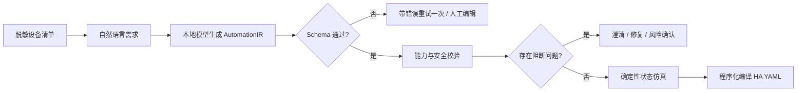

# HomeFlow Guard

把自然语言智能家居需求编译为**可检查、可仿真、可导出**的 Home Assistant 自动化。

> 项目原则：模型只生成候选规则；确定性程序负责设备能力、安全约束、状态仿真和最终 YAML。

## 当前真实状态

- 已完成：设备清单校验、结构化 AutomationIR、能力与安全检查、敏感动作确认、状态仿真、YAML 编译、Streamlit 界面、50 条合成评测案例、评测脚本和自动化测试。
- 已验证：本地核心测试、参考 fixture、Qwen3 14B 开发集、同模型直接 YAML 基线、30 次稳定性运行与 8 条冻结演示案例；Prompt v1.0 已在锁定测试集运行前冻结。
- 尚未完成：35 条锁定测试集、3 名外部测试者可用性测试、公开 Demo/GitHub 链接仍待完成。
- 50 条合成场景已由项目负责人两轮逐条复核；这不是对真实用户数据的标注。严禁把 fixture 自检数字描述成模型效果。

2026-09-18 的旧标注开发实验保留在仓库供审计。第一轮人工复核纠正了部分标准答案，因此旧指标不能代表当前版本。2026-09-20 修订后开发集实测与冻结输入见[评测记录](docs/evaluation_report.md)和 `artifacts/freeze_v1.json`；两者都不是 35 条锁定测试集成绩。

## 为什么不是聊天套壳



模型永远不能直接控制设备，也不能把原始文本直接作为最终 YAML 导出。

## 5 分钟开始

建议使用 Python 3.11–3.13。

```powershell
python -m venv .venv
.venv\Scripts\Activate.ps1
python -m pip install -r requirements.txt
streamlit run app.py
```

公开样例模式不需要模型。当前已固化 8 条真实本地模型运行结果，并保留模型 digest、Prompt 版本、延迟和输出哈希；它们用于体验校验、仿真和导出，不是在线实时调用，也不代表最终测试集效果。

### 本地 AI 模式

安装或更新 Ollama 后：

```powershell
ollama pull qwen3:14b-q4_K_M
ollama serve
```

若 14B 无法稳定运行，固定使用：

```powershell
ollama pull qwen3:8b-q4_K_M
```

打开应用侧栏，选择“本地 Ollama”。模型只在本机处理设备清单与需求。固定配置为 `temperature=0`、`seed=42`、`num_ctx=8192`、`think=false`，并随每次运行记录。本机已实际运行 `Ollama 0.34.1` 与 `qwen3:14b-q4_K_M`；完整 manifest digest、硬件和测试日期保存在 `artifacts/environment.json`。未安装的 8B 降级模型仍标记为 `null`，不得写成已使用。

## 支持范围

| 类型 | v0.1 支持 |
|---|---|
| 设备域 | `light`、`climate`、`cover`、`media_player`、`lock`、`binary_sensor` |
| 触发器 | 时间、状态、数值阈值、日出日落、手动 |
| 条件 | 时间范围、状态、数值阈值 |
| 动作 | 能力清单内的服务与有限参数 |
| 输出 | 单条自动化、`mode: single`、Home Assistant YAML 子集 |

不支持真实设备连接、Token、Jinja、循环、延时、嵌套 `choose`、多自动化全局冲突和安防解除。

## 数据格式

上传文件必须是 UTF-8 YAML/JSON，不超过 1MB、100 个实体。禁止字段包括 Token、API Key、密码、家庭地址和经纬度。

```yaml
inventory_id: my_sanitized_home
title: 脱敏家庭
provenance: user_sanitized
devices:
  - entity_id: light.living_main
    domain: light
    area: 客厅
    display_name: 客厅主灯
    capabilities: [power, brightness]
    allowed_services: [light.turn_on, light.turn_off]
    parameter_ranges:
      brightness: [1, 255]
    sensitivity: normal
```

## 安全检查

- `UNKNOWN_ENTITY`：实体不在设备清单。
- `UNSUPPORTED_SERVICE` / `DOMAIN_MISMATCH`：设备不支持服务。
- `PARAMETER_OUT_OF_RANGE`：温度、亮度、音量或位置越界。
- `UNSUPPORTED_ATTRIBUTE`：空调室温触发/条件必须使用已声明的 `current_temperature`，不能误用目标设定温度 `temperature`。
- `ACTION_CONFLICT`：同一设备在同一规则中收到冲突动作。
- `SELF_TRIGGER_LOOP`：触发设备又执行 toggle，存在重复触发风险。
- `SENSITIVE_ACTION`：门锁解锁必须使用精确确认键确认。

任何阻断问题都会关闭 YAML 下载。

## 评测

评测集包含 50 条 AI 起草、项目负责人逐条复核的合成场景：15 条开发集、35 条测试集。复核原表见 `data/reviews/round1.csv` 与 `data/reviews/round2.csv`。复核完成不等于模型评测完成。

仅在从零创建新评测集时生成复核表（当前已经审核，**不要再次运行 export**，以免清空决定）：

```powershell
python scripts/review_dataset.py export
```

只验证评分代码：

```powershell
python scripts/evaluate.py --mode fixture --pipeline guarded --split all
```

在开发集上运行真实模型。Prompt v1.0 已按 15 条开发集结果冻结；下列命令可复现开发流程，但不得用 35 条锁定测试集调参：

```powershell
python scripts/evaluate.py --mode ollama --pipeline both --split dev --model qwen3:14b-q4_K_M
```

开发集 guarded 运行完成后，可把 8 条实际本地模型输出固化为不联网的公开演示案例：

```powershell
python scripts/freeze_demo_cases.py --prompt-version compiler-dev-v0.8
```

固化文件会保存模型标签、digest、Prompt 版本、延迟和输出哈希；应用会明确标注它不是实时模型调用。

对 10 条开发压力案例各重复 3 次并记录归一化 IR 稳定率：

```powershell
python scripts/stability_test.py --model qwen3:14b-q4_K_M --repeats 3
```

正式测试集在标签、Prompt、基线 Prompt、设备清单和模型 digest 全部冻结后运行，不加 `--allow-pending-labels`；脚本会核对 `artifacts/freeze_v1.json`：

```powershell
python scripts/evaluate.py --mode ollama --pipeline both --split test --model qwen3:14b-q4_K_M
```

原始运行记录保存在 `artifacts/model_runs/`；汇总生成 `latest_evaluation.json` 与 CSV。指标只适用于公开合成集和当次硬件环境。

旧标注开发集结果由 `artifacts/evaluations/rescored-compiler-dev-v0.json` 和 `rescored-baseline-v1.json` 从保存的原始输出重算；稳定性记录位于 `artifacts/latest_stability.json`。它们仅供迭代审计，不能作为当前冻结版成绩。当前开发集 v0.12 与基线的重算报告也单独归档在 `artifacts/evaluations/`。

指标定义变化时，使用 `python scripts/rescore_runs.py --run-version <版本> --pipeline guarded --split dev` 从已保存输出重算，避免用新模型输出覆盖旧实验。

运行 `python scripts/collect_environment.py` 可生成不含用户名、主机名、IP、Token 和设备清单的环境记录；模型未安装时 digest 会如实为 `null`。

## 测试

```powershell
ruff check .
python -m pytest
```

测试覆盖输入隐私、未知实体、参数越界、动作冲突、门锁确认、仿真、YAML 快照、基线口径与评测集完整性。

## 隐私与边界

- 示例家庭、状态和评测案例全部为合成数据。
- Streamlit 应用不包含数据库；上传内容只存在当前会话内存。
- 本地模型模式不向云端发送内容。
- 项目不接入任何真实 Home Assistant 实例，不对现实设备执行动作。
- 导出的 YAML 在部署前必须由用户在隔离环境再次检查。

详见 [隐私说明](docs/privacy.md)、[数据卡](docs/data_card.md)、[评测记录](docs/evaluation_report.md) 和 [发布清单](docs/release_checklist.md)。

## 项目结构

```text
app.py                    五步 Streamlit 产品界面
homeflow/                 Schema、模型调用、校验、仿真、导出、评测
data/                     虚拟家庭、状态和 50 条合成场景
prompts/                  冻结的基线与最终方案 Prompt
scripts/                  数据构建、人工复核和评测入口
tests/                    单元、集成与安全测试
docs/                     数据、隐私、用户测试与求职包装
```

## 许可证

代码使用 MIT License；合成数据仅用于产品演示与评测，不代表真实用户行为。
